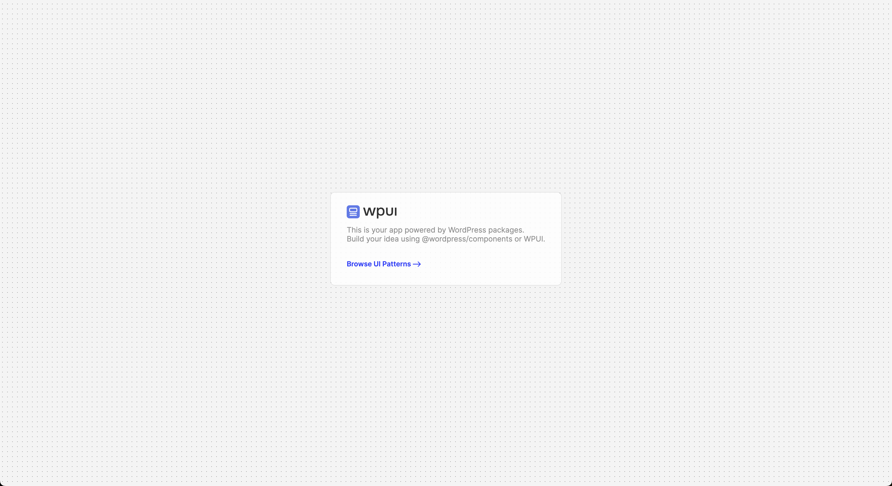

# WPUI Sample App
### Build Your React Powered WordPress Plugin Or App With Speed.
WPUI is a design pattern library built upon wordpress components Which gives you the building blocks you need to build your react-powered WordPress plugin or app. spend less time on UI and more time building your idea.

[🌐 Live Demo](https://wpui-sample-app.pages.dev/)

## Usage
- Clone `git clone git@github.com:lubusIN/wpui-sample-app.git my-app`
- Open app directory `cd my-app`
- Add and update app as required

## Development 
- Install dependencies `npm install`
- Watch for chanegs in dev `npm run start`
- Build production assets `npm run build`
- Watch for local dev and launch app `npm run dev`

## Craftsmen
- [Ajit Bohra](https://twitter.com/ajitbohra)
- [Pravin Prajapati](https://twitter.com/buddhamaan)
- [Punit Verma](https://github.com/punitverma123)
- [Nikhil Sharma](https://github.com/NikhilSharma666)

## Meet Your Artisans
[LUBUS](http://lubus.in) is a web design agency based in Mumbai, India.

## License

`WPUI` is an open-source software licensed under the [MIT](LICENSE)